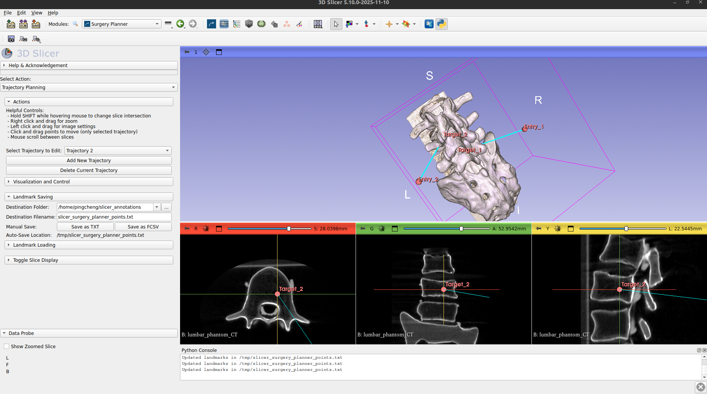
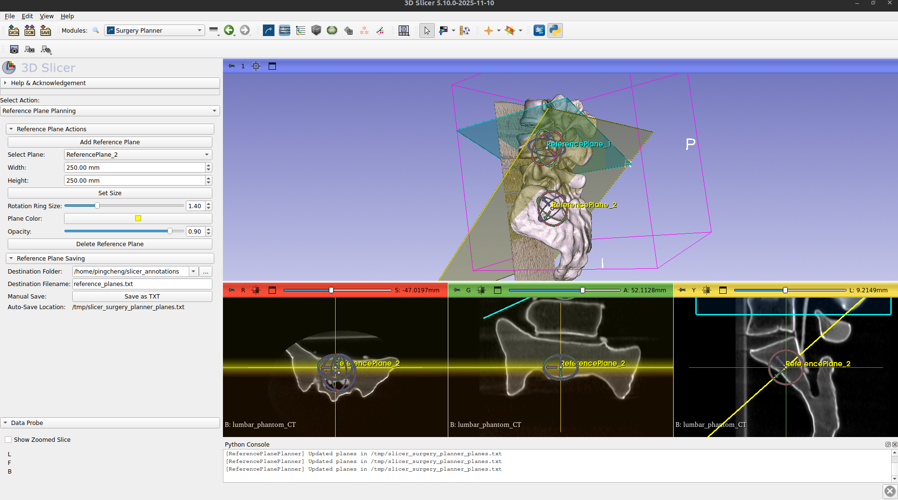

# Surgery Planner

This module is modified from InjectionTrajectoryPlanner developed by Henry Phalen. The original repository can be found at https://github.com/htp2/InjectionTrajectoryPlanner

Slicer Version 5.10 or higher
## Overview

The Surgery Planner module allows for planning surgery trajectories and segmentations on 3D volumes/images. It has been refactored into a modular architecture to support multiple planning modes.

### Key Features

1.  **Trajectory Planning**:
    *   Set Target and Entry points for a trajectory.
    *   Visualize trajectories with a line projected into slice images and 3D rendering.
    *   **Dynamic Slice Views**: Toggle between typical anatomical views (Axial, Sagittal, Coronal) and a 'Down Trajectory' view that looks straight down the line of injection.
    *   **Landmark Management**: Save and load landmarks (Target/Entry points) to/from TXT or FCSV files. Currently a copy of the landmark file is constantly being saved to a temporary folder at `/tmp/slicer_surgery_planner_points.txt`. This is to support dynamic view and calculation of trajectory transforms and is required to run dyanmic annotation for `bigss-slicer-planner-visualizer` repo. (Please refer to: https://github.com/uark-i3r-bigss/bigss-slicer-planner-visualizer)
    *   **Multiple Trajectories**: Create and manage multiple trajectories within the scene.

2.  **Segmentation Planning**:
    *   Create and manage Segmentation nodes for outlining anatomical structures.
    *   (To be implemented)

3.  **Reference Plane Planning**:
    *   Create and manage Reference Planes (`vtkMRMLMarkupsPlaneNode`) for visualizing 2D cross-sections.
    *   Interactive planes can be moved, rotated, and resized in the 3D view.

## Setup Instructions

After cloning this module:
1.  Open Slicer.
2.  In the 'Welcome to Slicer' Module, click 'Customize Slicer'.
3.  Press the **Modules** tab.
4.  Under 'Paths', select **Add**.
5.  Select the folder that contains this `README.md` document (the `SurgeryPlanner` directory).
6.  Restart Slicer as prompted.
7.  The module should appear under the group name **Planning** or **SpineRobot** (depending on configuration).

## Usage

Upon opening the module, use the **Select Action** dropdown to switch between modes:

*   **Create Trajectory**: Access tools for adding trajectories, moving points, and visualizing slices.
*   **Create Segmentation**: Access tools for adding and removing segmentation nodes.
*   **Reference Plane Planning**: Access tools for adding and removing interactive reference planes.
*   **Restart Slicer**: Quickly restart Slicer to reload the module (useful for development).

## Example 

This example shows the Trajectory Planner function for our module.

This example shows the Reference Plane Planner function for our module. Multiple planes can be created and managed in the same scene, and the control of the plane position and orientation can be adjusted interactively.

## Contact Information
Ping-Cheng Ku (pku1@jhu.edu)